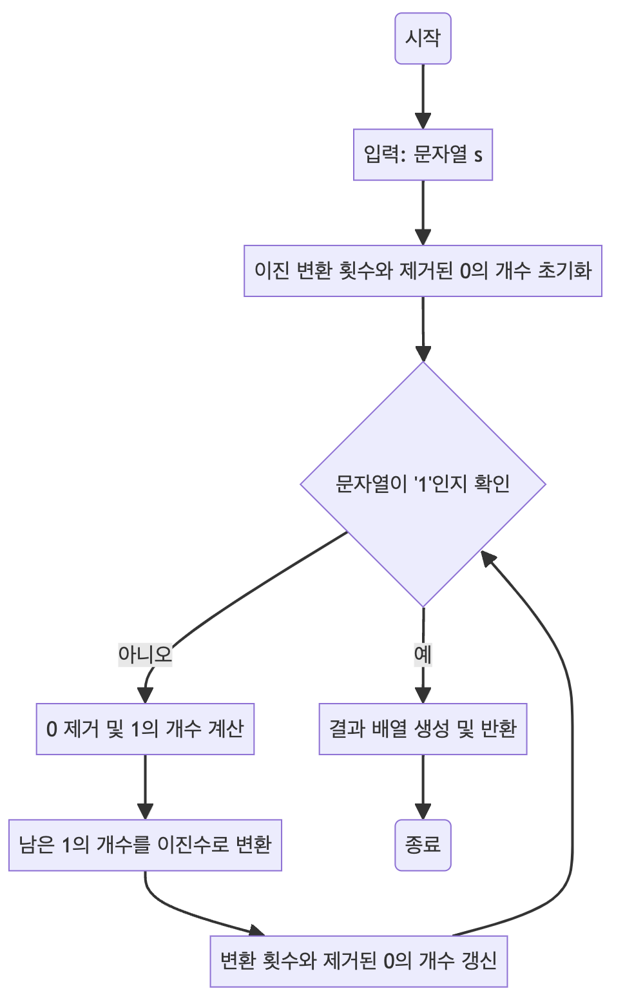

> [CH02_탐색_PART2](../) / [02_문자열](./)

# 프로그래머스 : 이진 변환 반복하기
> https://school.programmers.co.kr/learn/courses/30/lessons/70129

## 설계
- 문자열 s를 이진 변환하는 과정을 거쳐, 모든 0을 제거하고, 남은 1들의 개수에 대한 이진수로 변환하는 과정을 반복
- 각 변환 과정에서 제거된 0의 개수와 변환 횟수를 계산하여 반환.
- 이진 변환 과정은 문자열을 순회하면서 0을 제거하고, 남은 1의 개수를 이진수 형태로 변환하는 방식으로 진행.
-  while 반복문을 사용하여 주어진 조건이 충족될 때까지 변환 과정을 반복하고, Integer.toBinaryString 메서드를 활용하여 정수를 이진수 문자열로 변환.

## 구현


## 코드
### Java
```java
// package pg70129;

import java.util.*;

// public class Main {
//     public static void main(String[] args) {
//         Solution solution = new Solution();
//         // 결과 출력
//         System.out.println(
//             Arrays.toString(solution.solution("110010101001")));  
//         System.out.println(
//             Arrays.toString(solution.solution("01110")));  
//         System.out.println(
//             Arrays.toString(solution.solution("1111111")));  
//     }
// }

class Solution {
    public int[] solution(String s) {
        System.out.println(s); // 초기 문자열 출력 (디버깅용)
        int countTransitions = 0; // 이진 변환 횟수
        int countZero = 0; // 제거된 0의 개수

        // 문자열이 "1"이 될 때까지 반복
        while (!s.equals("1")) {
            String temp = ""; // 0을 제거한 후의 새로운 문자열
            for(int i = 0; i < s.length(); i++) {
                if(s.charAt(i) == '0') {
                    // 0이면 제거하고 카운트 증가
                    countZero++;
                } else {
                    // 1이면 temp 문자열에 추가
                    temp += "1";
                }
            }
            // 남은 1의 개수에 대한 이진수로 변환
            s = Integer.toBinaryString(temp.length());
            System.out.println(s); // 변환된 문자열 출력 (디버깅용)
            countTransitions++; // 변환 횟수 증가
        }
        int[] answer = {countTransitions, countZero}; // 결과 배열
        return answer; // 결과 반환
    }
}
```
### Python
```python
def solution(s):
    # print(s)  # 초기 문자열 출력 (디버깅용)
    count_transitions = 0  # 이진 변환 횟수
    count_zero = 0  # 제거된 0의 개수

    # 문자열이 "1"이 될 때까지 반복
    while s != '1':
        temp = ''  # 0을 제거한 후의 새로운 문자열
        for c in s:
            if c == '0':
                # 0이면 제거하고 카운트 증가
                count_zero += 1
            else:
                # 1이면 temp 문자열에 추가
                temp += '1'
        # 남은 1의 개수에 대한 이진수로 변환
        s = format(len(temp), 'b')
        # print(s)  # 변환된 문자열 출력 (디버깅용)
        count_transitions += 1  # 변환 횟수 증가

    return [count_transitions, count_zero]  # 결과 반환

# 테스트 케이스 실행
print(solution('110010101001'))
print(solution('01110'))
print(solution('1111111'))
```